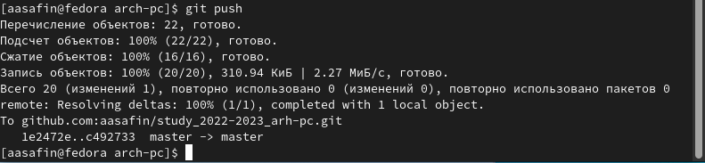

---
## Front matter
title: "Отчет по лабораторной работе №3"
author: "Сафин Андрей Алексеевич"

## Generic otions
lang: ru-RU
toc-title: "Содержание"

## Pdf output format
toc: true # Table of contents
toc-depth: 2
lof: true # List of figures
lot: true # List of tables
fontsize: 12pt
linestretch: 1.5
papersize: a4
documentclass: scrreprt
## I18n polyglossia
polyglossia-lang:
  name: russian
  options:
	- spelling=modern
	- babelshorthands=true
polyglossia-otherlangs:
  name: english
## I18n babel
babel-lang: russian
babel-otherlangs: english
## Fonts
mainfont: PT Serif
romanfont: PT Serif
sansfont: PT Sans
monofont: PT Mono
mainfontoptions: Ligatures=TeX
romanfontoptions: Ligatures=TeX
sansfontoptions: Ligatures=TeX,Scale=MatchLowercase
monofontoptions: Scale=MatchLowercase,Scale=0.9
## Biblatex
biblatex: true
biblio-style: "gost-numeric"
biblatexoptions:
  - parentracker=true
  - backend=biber
  - hyperref=auto
  - language=auto
  - autolang=other*
  - citestyle=gost-numeric
## Pandoc-crossref LaTeX customization
figureTitle: "Рис."
tableTitle: "Таблица"
listingTitle: "Листинг"
lofTitle: "Список иллюстраций"
lotTitle: "Список таблиц"
lolTitle: "Листинги"
## Misc options
indent: true
header-includes:
  - \usepackage{indentfirst}
  - \usepackage{float} # keep figures where there are in the text
  - \floatplacement{figure}{H} # keep figures where there are in the text
---

# Цель работы

Изучение идеологии и применение средств контроля версий. Приобретение
практических навыков работы с системой контроля версий git.

# Задание

Создание репозитория на github, настройка и подключение его к компьютеру.

# Выполнение лабораторной работы

В первую очередь была создана учётная запись на github (Рис. [-@fig:001]) и
произведена первичная настройка git на виртуальной машине (Рис [-@fig:002]). Далее
был создан SSH ключ (скриншот отсутствует), скопирован в буфера обмена с
предварительной установкой пакета xclip для использования необходимой
команды (Рис. [-@fig:003]) и добавлен на girhub (Рис. [-@fig:004]).

{ #fig:001 width=70% }

{ #fig:002 width=70% }

{ #fig:003 width=70% }

{ #fig:004 width=70% }

Затем была создана директория для размещения клона репозитория (Рис. [-@fig:005]).
На аккаунте github был создан новый репозиторий по шаблону а затем
клонирован на виртуальную машину (Рис. [-@fig:007]-[-@fig:006]). В связи с ошибкой вовведении аргументов команды клонирования соответствующая директория
была переименована вручную (Рис. [-@fig:008]).

{ #fig:005 width=70% }

{ #fig:006 width=70% }

{ #fig:007 width=70% }

{ #fig:008 width=70% }

Далее были произведены необходимые настройки каталога курса (Рис.[-@fig:009] -
[-@fig:011]), после чего он был готов к работе.

{ #fig:009 width=70% }

{ #fig:010 width=70% }

{ #fig:011 width=70% }

{ #fig:012 width=70% }

# Самостоятельная работа

В рамках самостоятельной работы файлы с отчетами по прошлым
лабораторным работам были также выгружены на репозиторий (Рис. [-@fig:013]-[-@fig:015]).

{ #fig:013 width=70% }

{ #fig:014 width=70% }

{ #fig:015 width=70% }

# Вывод

Создан, настроен и подключен к компьютеру репозиторий git. Навыки работы
с ним получены.

