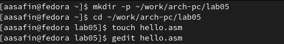
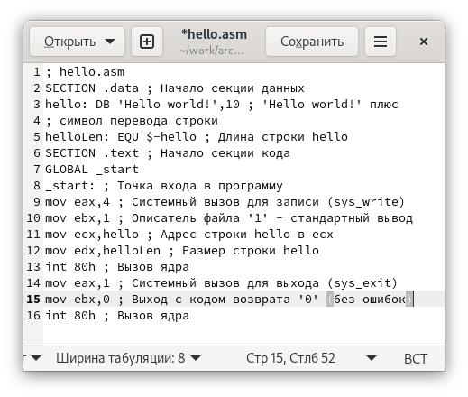
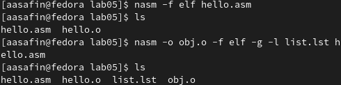
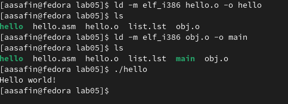
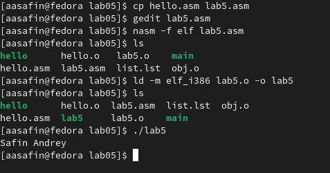
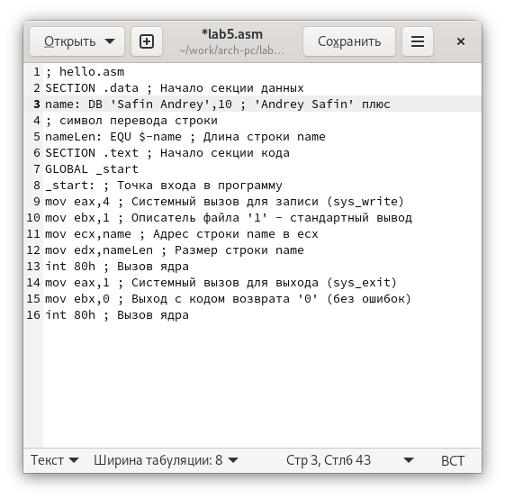
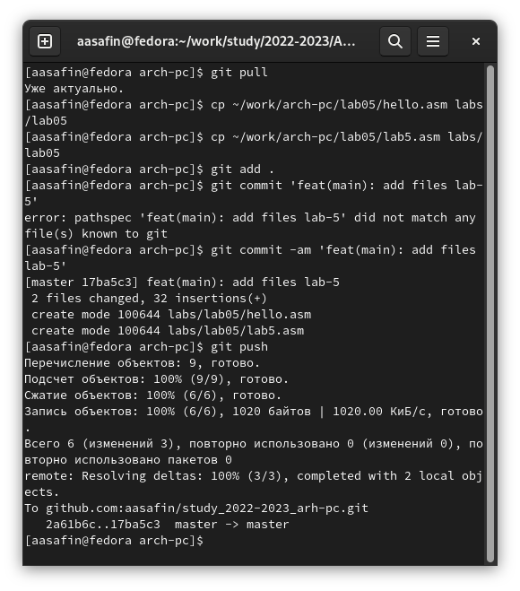

---
## Front matter
title: "Лабораторная работа номер 5"
author: "Сафин Андрей Алексеевич"

## Generic otions
lang: ru-RU
toc-title: "Содержание"

## Pdf output format
toc: true # Table of contents
toc-depth: 2
lof: true # List of figures
lot: true # List of tables
fontsize: 12pt
linestretch: 1.5
papersize: a4
documentclass: scrreprt
## I18n polyglossia
polyglossia-lang:
  name: russian
  options:
	- spelling=modern
	- babelshorthands=true
polyglossia-otherlangs:
  name: english
## I18n babel
babel-lang: russian
babel-otherlangs: english
## Fonts
mainfont: PT Serif
romanfont: PT Serif
sansfont: PT Sans
monofont: PT Mono
mainfontoptions: Ligatures=TeX
romanfontoptions: Ligatures=TeX
sansfontoptions: Ligatures=TeX,Scale=MatchLowercase
monofontoptions: Scale=MatchLowercase,Scale=0.9
## Biblatex
biblatex: true
biblio-style: "gost-numeric"
biblatexoptions:
  - parentracker=true
  - backend=biber
  - hyperref=auto
  - language=auto
  - autolang=other*
  - citestyle=gost-numeric
## Pandoc-crossref LaTeX customization
figureTitle: "Рис."
tableTitle: "Таблица"
listingTitle: "Листинг"
lofTitle: "Список иллюстраций"
lotTitle: "Список таблиц"
lolTitle: "Листинги"
## Misc options
indent: true
header-includes:
  - \usepackage{indentfirst}
  - \usepackage{float} # keep figures where there are in the text
  - \floatplacement{figure}{H} # keep figures where there are in the text
---

# Цель работы

Освоение процедуры компиляции и сборки программ, написанных на ассем-
блере NASM.

# Задание

Создать несколько файлов расширенирения nasm, транслировать их в объектный код, скомпоновать их в исполняемую программу и исполнить одну из них.

# Выполнение лабораторной работы

Создана директория ~/work/arch-pc/lab05 и файл hello.asm. Файл открыт с помощью текстового редактора (рис. [-@fig:001]).

{ #fig:001 width=70% }

В файл записан код программы, выводящей надпись "Hello world!" (рис. [-@fig:002]).

{ #fig:002 width=70% }

Программа транслирована в файл hello.o, а затем в файл obj.o с приложенным файлом листинга (рис. [-@fig:003]).

{ #fig:003 width=70% }

Файл hello.o скомпонован в файл с тем же названием без расширения, а obj.o - в файл с название main. Затем выполнена программа hello (рис. [-@fig:004]).

{ #fig:004 width=70% }

# Самостоятельная работа

Продублирован файл hello.asm со сменой названия на lab05.asm (рис. [-@fig:005]). Программа в файле изменена так, чтоб выводилась строка с именем (рис. [-@fig:006]). Файл транслирован а застем скомпонован в программу lab5. Программа выполнена (рис. [-@fig:005]).

{ #fig:005 width=70% }

{ #fig:006 width=70% }

Затем файлы hello.asm и lab5.asm скопированы в соответствующую директорию каталога курса. Изменения выгружены на github.

{ #fig:007 width=70% }

# Выводы

Процесс сборки компиляции программ на nasm полностью пройден и повторен в рамках самостоятельной работы.
