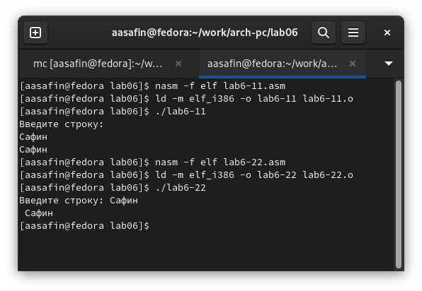

---
## Front matter
title: "Лабораторная работа номер 6"
author: "Сафин Андрей Алексеевич"

## Generic otions
lang: ru-RU
toc-title: "Содержание"

## Pdf output format
toc: true # Table of contents
toc-depth: 2
lof: true # List of figures
lot: true # List of tables
fontsize: 12pt
linestretch: 1.5
papersize: a4
documentclass: scrreprt
## I18n polyglossia
polyglossia-lang:
  name: russian
  options:
	- spelling=modern
	- babelshorthands=true
polyglossia-otherlangs:
  name: english
## I18n babel
babel-lang: russian
babel-otherlangs: english
## Fonts
mainfont: PT Serif
romanfont: PT Serif
sansfont: PT Sans
monofont: PT Mono
mainfontoptions: Ligatures=TeX
romanfontoptions: Ligatures=TeX
sansfontoptions: Ligatures=TeX,Scale=MatchLowercase
monofontoptions: Scale=MatchLowercase,Scale=0.9
## Biblatex
biblatex: true
biblio-style: "gost-numeric"
biblatexoptions:
  - parentracker=true
  - backend=biber
  - hyperref=auto
  - language=auto
  - autolang=other*
  - citestyle=gost-numeric
## Pandoc-crossref LaTeX customization
figureTitle: "Рис."
tableTitle: "Таблица"
listingTitle: "Листинг"
lofTitle: "Список иллюстраций"
lotTitle: "Список таблиц"
lolTitle: "Листинги"
## Misc options
indent: true
header-includes:
  - \usepackage{indentfirst}
  - \usepackage{float} # keep figures where there are in the text
  - \floatplacement{figure}{H} # keep figures where there are in the text
---

# Цель работы

Приобретение практических навыков работы в Midnight Commander. Освоение инструкций языка ассемблера mov и int.

# Задание

С помощью Midnight Commander создать ряд файлов и директорий. Написать программу, запрашивающую ввод строки, в двух варицаиях, и проверить работу итоговых исполняемых файлов. В рамках самостоятельной работы дополнить обе вариации программы. 

# Выполнение лабораторной работы

Создан подкаталог lab06 в ранее созданном каталоге ~/work/arch-pc (рис. [-@fig:003]). В нем с помощью команды touch создан файл lab6-1.asm (рис. [-@fig:005]), в котором записана программа, выводящая текст "Введите строку:" и сохраняющая введенную информацию (рис. [-@fig:006]).

{ #fig:003 width=80% }

{ #fig:005 width=80% }

{ #fig:006 width=80% }

Создан исполняемый файл. Проверена работа программы (рис. [-@fig:007]). Всё выполняется правильно. 

{ #fig:007 width=80% }

Далее был скачен файл in_out.asm и в директорию lab06 (рис. [-@fig:008]). После чего файл lab6-1.asm был скопирован туда же с названием lab6-2.asm (рис. [-@fig:009]) и в нем программа была отредактирована так, чтобы она работала аналогичным образом, но с использованием ссылок на in_out.asm (рис. [-@fig:010]).

{ #fig:008 width=80% }

{ #fig:009 width=80% }

{ #fig:010 width=80% }

Проверена корректность выполнения исполняемого файла, созданного трансляцией и компоновкой из lab6-2.asm (рис. [-@fig:011]). Затем изменен текст lab6-2.asm (команда sprintLF заменена на sprint) (рис. [-@fig:012]), что привело к вызову ввода строки на той же строке, где выводится надпись "Введите строку:", а не ниже (рис. [-@fig:013]).

{ #fig:011 width=80% }

{ #fig:012 width=80% }

{ #fig:013 width=80% }

# Самостоятельная работа

Созданы копии lab6-1.asm и lab6-2.asm с именами lab6-11.asm lab6-22.asm соот. (рис. [-@fig:014] - имеется только скриншот создания lab6-11.asm). 

{ #fig:014 width=80% }

Программа lab6-11.asm дополнена так, чтобы после ввода строки она выводилась на экран (рис. [-@fig:015]). Файл оттранслирован и скомпонован, работа проверена - всё корректно (рис. [-@fig:016]).

{ #fig:015 width=80% }

{ #fig:016 width=80% }

Аналогичные действия проведены с файлом lab6-22.asm, используя команды со ссылкой на in-out.asm (рис. [-@fig:017], [-@fig:018]).

{ #fig:017 width=80% }

{ #fig:018 width=80% }

# Выводы

Создание файлов проведено с использованием MC. Все необходиые программы написаны и выполнены корректно. В рамках самостоятельной работы программы соответствующим образом изменены и исполнены.

