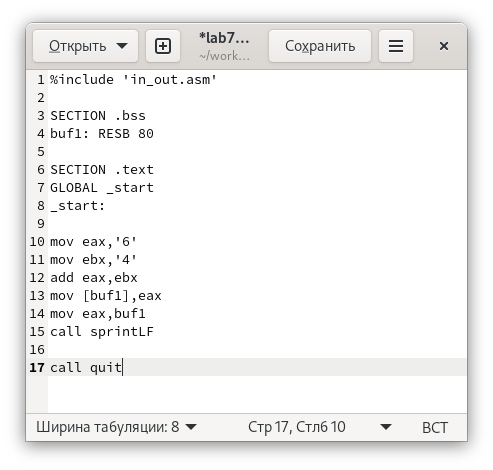
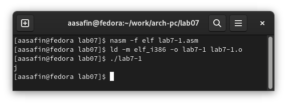
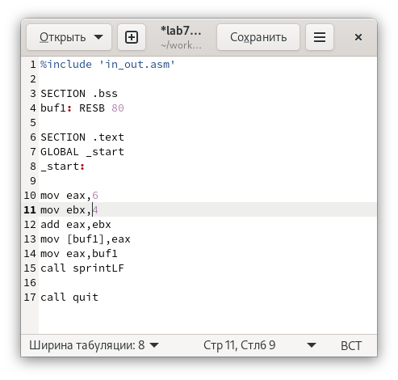

---
## Front matter
title: "Отчет по лабораторной работе номер 7"
author: "Сафин Андрей Алексеевич"

## Generic otions
lang: ru-RU
toc-title: "Содержание"

## Pdf output format
toc: true # Table of contents
toc-depth: 2
lof: true # List of figures
lot: true # List of tables
fontsize: 12pt
linestretch: 1.5
papersize: a4
documentclass: scrreprt
## I18n polyglossia
polyglossia-lang:
  name: russian
  options:
	- spelling=modern
	- babelshorthands=true
polyglossia-otherlangs:
  name: english
## I18n babel
babel-lang: russian
babel-otherlangs: english
## Fonts
mainfont: PT Serif
romanfont: PT Serif
sansfont: PT Sans
monofont: PT Mono
mainfontoptions: Ligatures=TeX
romanfontoptions: Ligatures=TeX
sansfontoptions: Ligatures=TeX,Scale=MatchLowercase
monofontoptions: Scale=MatchLowercase,Scale=0.9
## Biblatex
biblatex: true
biblio-style: "gost-numeric"
biblatexoptions:
  - parentracker=true
  - backend=biber
  - hyperref=auto
  - language=auto
  - autolang=other*
  - citestyle=gost-numeric
## Pandoc-crossref LaTeX customization
figureTitle: "Рис."
tableTitle: "Таблица"
listingTitle: "Листинг"
lofTitle: "Список иллюстраций"
lotTitle: "Список таблиц"
lolTitle: "Листинги"
## Misc options
indent: true
header-includes:
  - \usepackage{indentfirst}
  - \usepackage{float} # keep figures where there are in the text
  - \floatplacement{figure}{H} # keep figures where there are in the text
---

# Цель работы

Освоение арифметических инструкций языка ассемблера NASM.

# Задание

Написать ряд программ, производящих арифметический операции (в том числе с введенными значениями) и выводящие результаты на экран. В процессе написания прийти к корректному вводу и выводу численных данных с помощью команд, обращающихся к коду ASCII.

# Выполнение лабораторной работы

1. Cоздан файл lab7-1.asm. В соответствующую директорию перемещен файл in_out.asm (рис. [-@fig:001]). 
2. В файл lab7-1.asm записана программа, выполняющая вычисления (рис. [-@fig:002]). Однако результат выполнения такой программы не корректен (рис.[-@fig:002]) , так как все вычисления выполнены с кодами символов '6' и '4'. 
3. Программа переписана так, чтоб в качестве операндов сложения выступали именно числа 6 и 4 (рис. [-@fig:004]), однако на экран выводится всё ещё неверный результат (рис. [-@fig:005]), так как вместо, собственно, числа выводится символ, код которого соответствует этому числу (переводящий на следующую строку cимвол).

{ #fig:001 width=80% }

{ #fig:002 width=80% }

{ #fig:003 width=80% }

{ #fig:004 width=80% }

{ #fig:005 width=80% }

4. Создан файл lab7-2.asm (рис. [-@fig:007]), в котором написана программа с приведением численной информации к соответствующем значениям кода ASCII при выводе на экран (рис. [-@fig:006]), однако результат выполнения которой всё ещё некорректен, так как в качестве операндов указываются строки '6' и '4' (рис. [-@fig:007]). 
5. Затем в качестве операндов записаны численные значения (рис. [-@fig:008]), в результате чего программа выводит на экран верный результат: 10 (рис. [-@fig:009]).

{ #fig:006 width=80% }

{ #fig:007 width=80% }

{ #fig:008 width=80% }

{ #fig:009 width=80% }

Далее вместо команды iprintLF в lab7-2.asm записана команда iprint (рис. [-@fig:010]). Как можно видеть по результату (рис. [-@fig:011]), разница состоит в том, что вторая команда не приводит к переходу на следующую строку при выведении результата на экран.

{ #fig:010 width=80% }

{ #fig:011 width=80% } 

6. Был создан файл lab7-3.asm (рис. [-@fig:013]), в котором была написана программа, выводящая значение выражения (5\*2+3)/3 вместе с остатком от деления (рис. [-@fig:012], [-@fig:013]). Затем текст lab7-3.asm был изменен так (рис. [-@fig:014]), чтоб новый исполняемый файл приводил к выведению на экран значения (4\*6+2)/5 (рис. [-@fig:015]).

{ #fig:012 width=80% }

{ #fig:013 width=80% }

{ #fig:014 width=80% }

{ #fig:015 width=80% }

7. Создан файл variant.asm (рис. [-@fig:017]), в него записана программа (рис. [-@fig:016]), вычисляющая вариант задания по введенному номеру студенческого билета по формуле (x mod 20)+1 и выводящая номер варианта на экран (рис. [-@fig:017]) (для введенного номера билета автора лабораторной работы, очевидно, результат корректен). 

{ #fig:016 width=80% }

{ #fig:017 width=80% }

# Ответы на впоросы к лабораторной работе

1. mov eax,rem; call sprint
2. mov ecx, x - перемещение адреса x в регистр ecx; mov edx, 80 - запись в регистр edx значения 80; call sread - вызов кода из in_out.asm, отвечающего за ввод строки в переменную, адрес которой хранится в eax (притом длина строки должна быть обозначена в ebx). 
3. call atoi преобразует код ASCII в регистре eax в целочисленное значение, которое обозначается соответствующими символами.
4. xor edx,edx; mov ebx,20; div ebx; inc edx
5. В регистр edx
6. Для увеличения значения в edx на единицу
7. mov eax,edx; call iprintLF

# Самостоятельная работа

Создан файл sr.asm (рис. [-@fig:019]). Написана программа, выводящая выражение f(x)=(8x+6)\*10, выполняющая вычисление значения f(x)=(8x+6)\*10 по введенному x и выводящая значение на экран (рис. [-@fig:018]). Её работа проверена на значениях 1 и 4 (рис. [-@fig:019]). Результат корректен.

{ #fig:018 width=80% }

{ #fig:019 width=80% }

# Выводы

Все программы созданы и исполнены. Ответы на вопросы даны. В рамках самостоятельной работы предоставленная информация использована для написания программы с соответствующей функцией.

