---
## Front matter
title: "Отчет по лабораторной работе номер 8"
author: "Сафин Андрей Алексеевич"

## Generic otions
lang: ru-RU
toc-title: "Содержание"

## Pdf output format
toc: true # Table of contents
toc-depth: 2
lof: true # List of figures
lot: true # List of tables
fontsize: 12pt
linestretch: 1.5
papersize: a4
documentclass: scrreprt
## I18n polyglossia
polyglossia-lang:
  name: russian
  options:
	- spelling=modern
	- babelshorthands=true
polyglossia-otherlangs:
  name: english
## I18n babel
babel-lang: russian
babel-otherlangs: english
## Fonts
mainfont: PT Serif
romanfont: PT Serif
sansfont: PT Sans
monofont: PT Mono
mainfontoptions: Ligatures=TeX
romanfontoptions: Ligatures=TeX
sansfontoptions: Ligatures=TeX,Scale=MatchLowercase
monofontoptions: Scale=MatchLowercase,Scale=0.9
## Biblatex
biblatex: true
biblio-style: "gost-numeric"
biblatexoptions:
  - parentracker=true
  - backend=biber
  - hyperref=auto
  - language=auto
  - autolang=other*
  - citestyle=gost-numeric
## Pandoc-crossref LaTeX customization
figureTitle: "Рис."
tableTitle: "Таблица"
listingTitle: "Листинг"
lofTitle: "Список иллюстраций"
lotTitle: "Список таблиц"
lolTitle: "Листинги"
## Misc options
indent: true
header-includes:
  - \usepackage{indentfirst}
  - \usepackage{float} # keep figures where there are in the text
  - \floatplacement{figure}{H} # keep figures where there are in the text
---

# Цель работы

Изучение команд условного и безусловного переходов. Приобретение навыков написания программ с использованием переходов. Знакомство с назначением и структурой файла листинга.

# Задание

Составить описанные в лабораторной работе программы, использующие команды условного и безусловного переходов.

# Выполнение лабораторной работы

1. Созданы каталог lab08 и файл lab8-1.asm в нем (рис. [-@fig:001]). 
2. В файле записана программа из листинга 8.1 (рис. [-@fig:002]), выполняющая безусловный переход на секцию _label2 (рис. [-@fig:003]). Затем программа изменена так (рис. [-@fig:004]), чтоб переход затем выполнялся из _label2 в _label1, после чего программа приходила к завершению (рис. [-@fig:005]). Итоговый код в lab8-1.asm написан так (рис. [-@fig:006]), что программа идет в следующей последовательности: _label3 -> _label2 -> _label1 ->end (рис. [-@fig:007]). 

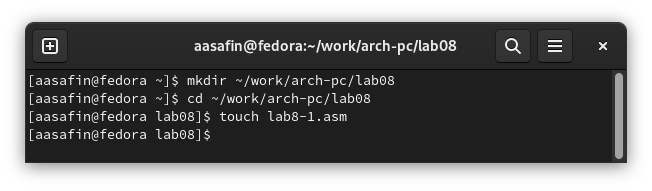{ #fig:001 width=80% }

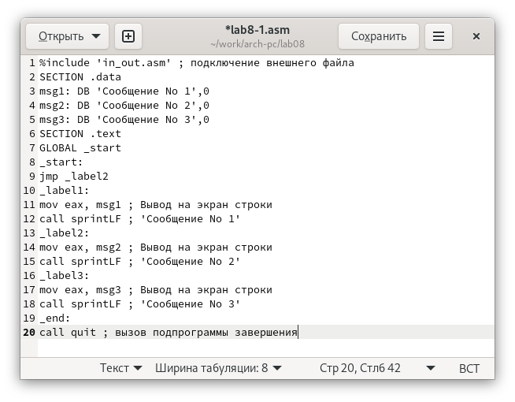{ #fig:002 width=80% }

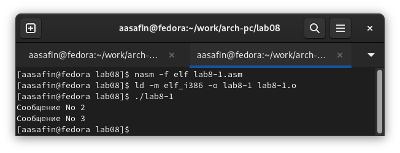{ #fig:003 width=80% }

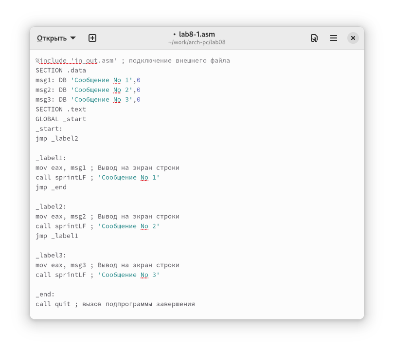{ #fig:004 width=80% }

{ #fig:005 width=80% }

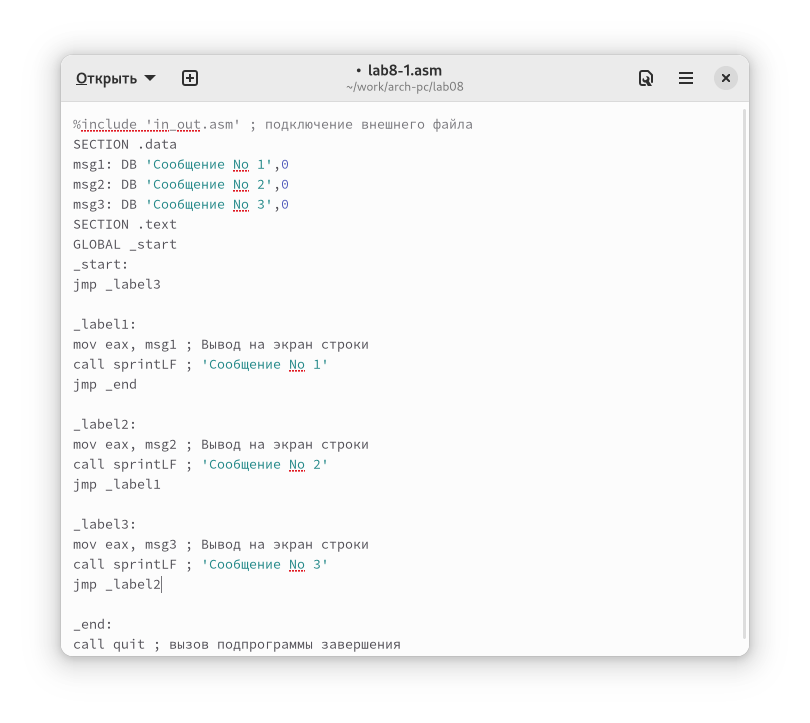{ #fig:006 width=80% }

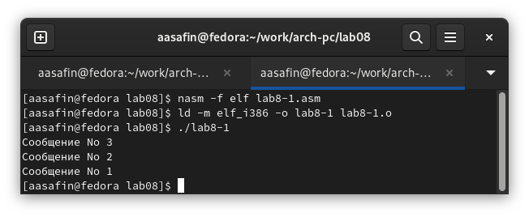{ #fig:007 width=80% }

3. Создан файл lab8-2.asm, в него введена программа из листинга 8.3 (рис. [-@fig:008]-[-@fig:009]), выполняющая сравнение чисел 20 и 50 с введенным, выводя максимальное (рис. [-@fig:010]).

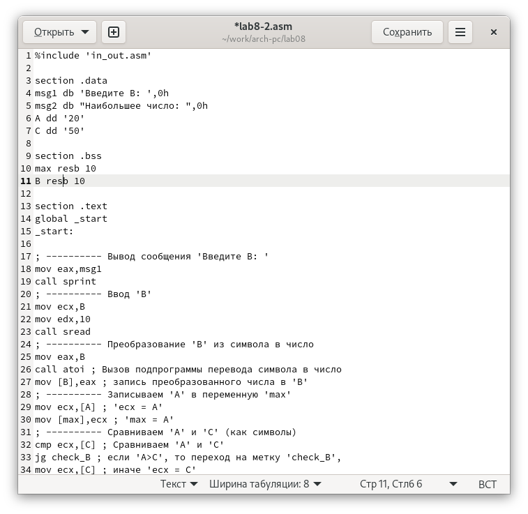{ #fig:008 width=80% }

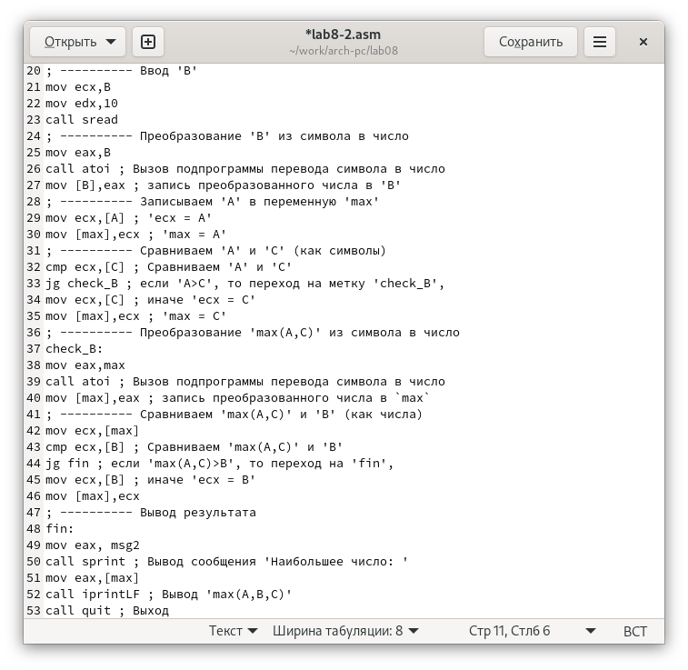{ #fig:009 width=80% }

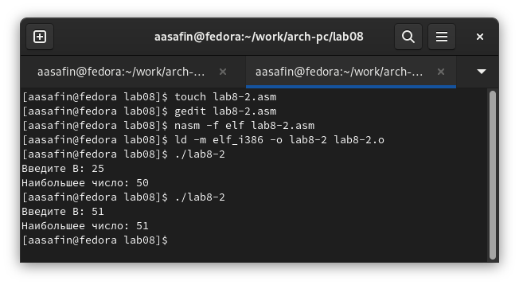{ #fig:010 width=80% }

4. Создан листинг программы lab8-2.asm (рис. [-@fig:011]). В рассматриваем фрагменте 20-ая строка имеет лишь номер, так как в ней нет кода, есть лишь комментарий. В 21-ой и 22-ой строках помимо номера и самого текста файла отображаются адреса (значения отступа от начала секции в машинном коде, записанные в 16-ной системе - 000000F2 и 000000F7 соответственно), а также сам машинный код, переведенный в 16-ную систему счисления (B8[00000000] и E81DFFFFFF соответственно). При удалении операнда B из команды, соответствующей 21-ой строке листинга  (рис. [-@fig:012]), после неё в новом листинге появляется сообщение об ошибке  (рис. [-@fig:014]).

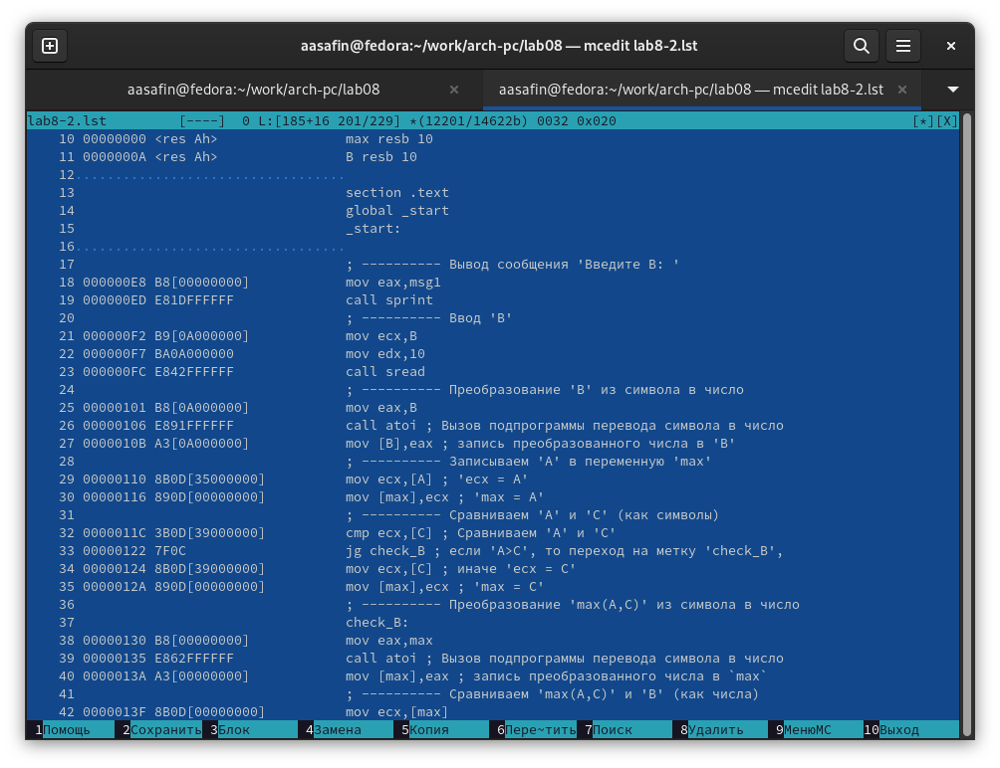{ #fig:011 width=80% }

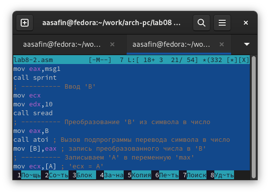{ #fig:012 width=80% }

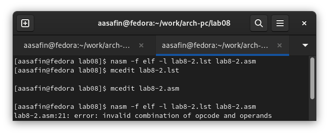{ #fig:013 width=80% }

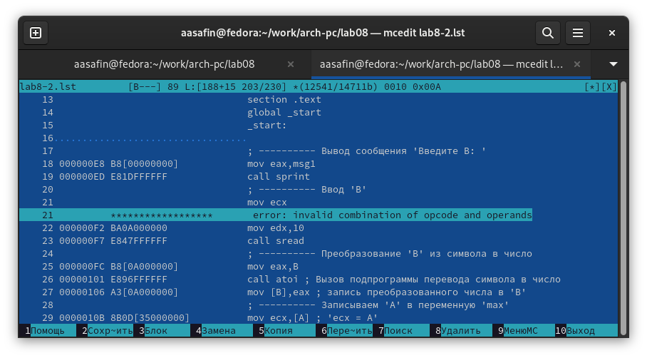{ #fig:014 width=80% }

# Самостоятельная работа

1. Создана программа, сравнивающая числа 84,32,77, соответствующие варианту, вычисленному по номеру студенческого билета (13), и выводящая наименьшее (рис. [-@fig:015]). Результат корректен (рис. [-@fig:016]).

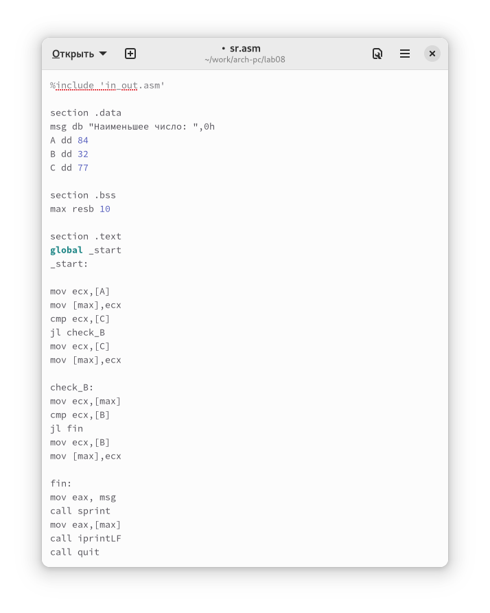{ #fig:015 width=80% }

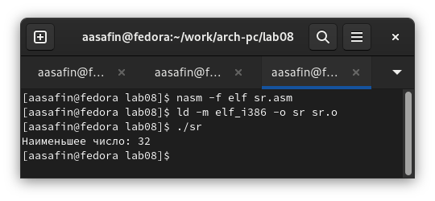{ #fig:016 width=80% }

2. Создана программа, вычисляющая для введенных значений x и a результат функции, соответствующей варианту 13, и выводящая результат на экран (рис. [-@fig:017]-[-@fig:018]). Результат для пробных значений корректен (рис. [-@fig:019]).  

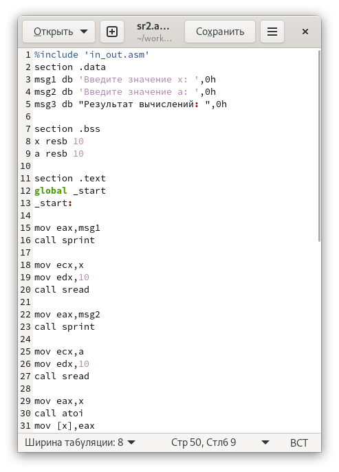{ #fig:017 width=80% }

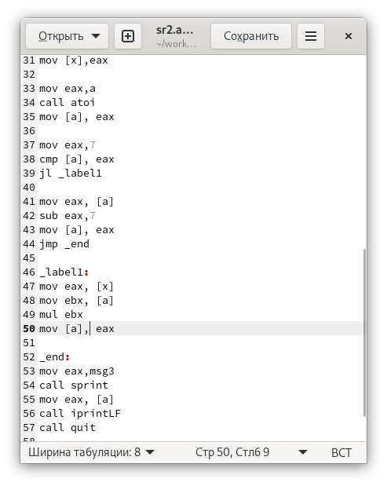{ #fig:018 width=80% }

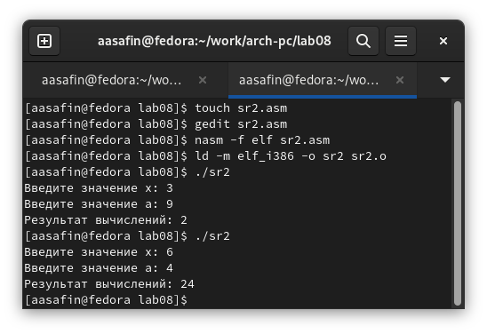{ #fig:019 width=80% }

# Выводы

Требуемые программы созданы и выполнены корректно. Команды условного и безусловного перехода рассмотрены и применены в рамках самостоятельной работы.

