---
## Front matter
title: "Отчет по лабораторной работе номер 9"
author: "Сафин Андрей Алексеевич"

## Generic otions
lang: ru-RU
toc-title: "Содержание"

## Pdf output format
toc: true # Table of contents
toc-depth: 2
lof: true # List of figures
lot: true # List of tables
fontsize: 12pt
linestretch: 1.5
papersize: a4
documentclass: scrreprt
## I18n polyglossia
polyglossia-lang:
  name: russian
  options:
	- spelling=modern
	- babelshorthands=true
polyglossia-otherlangs:
  name: english
## I18n babel
babel-lang: russian
babel-otherlangs: english
## Fonts
mainfont: PT Serif
romanfont: PT Serif
sansfont: PT Sans
monofont: PT Mono
mainfontoptions: Ligatures=TeX
romanfontoptions: Ligatures=TeX
sansfontoptions: Ligatures=TeX,Scale=MatchLowercase
monofontoptions: Scale=MatchLowercase,Scale=0.9
## Biblatex
biblatex: true
biblio-style: "gost-numeric"
biblatexoptions:
  - parentracker=true
  - backend=biber
  - hyperref=auto
  - language=auto
  - autolang=other*
  - citestyle=gost-numeric
## Pandoc-crossref LaTeX customization
figureTitle: "Рис."
tableTitle: "Таблица"
listingTitle: "Листинг"
lofTitle: "Список иллюстраций"
lotTitle: "Список таблиц"
lolTitle: "Листинги"
## Misc options
indent: true
header-includes:
  - \usepackage{indentfirst}
  - \usepackage{float} # keep figures where there are in the text
  - \floatplacement{figure}{H} # keep figures where there are in the text
---

# Цель работы

Приобретение навыков написания программ с использованием циклов и
обработкой аргументов командной строки.

# Задание

Написать ряд программ, содержащих инструкции циклов и работающих со стеком.

# Выполнение лабораторной работы

Создан файл lab9-1.asm в каталоге ~/work/arch-pc/lab09 (рис. [-@fig:002]). В него записана программа из листинга 9.1  (рис. [-@fig:001]), выводящая значения ecx циклично с учетом их изменения при применении команды loop (рис. [-@fig:003]). В текст внесено изменение: в цикл добавлено вычитание единицы из значения в ecx (рис. [-@fig:004]). В результате программа выполняется некорректно (рис. [-@fig:005]). 

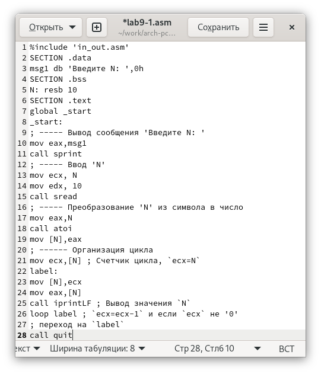{ #fig:001 width=70% }

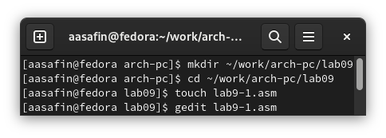{ #fig:002 width=70% }

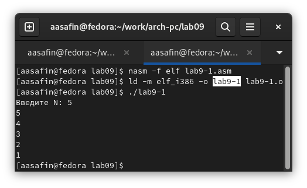{ #fig:003 width=70% }

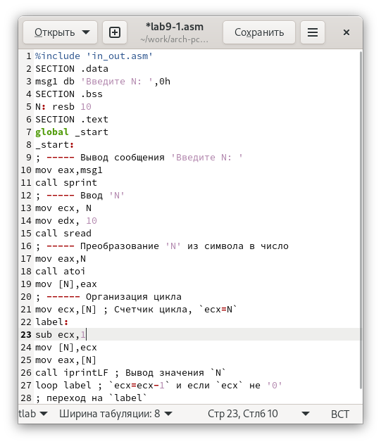{ #fig:004 width=70% }

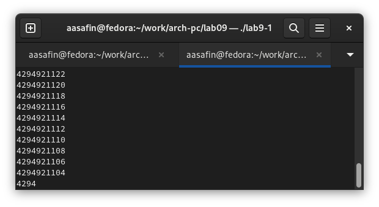{ #fig:005 width=70% }

Затем в тело цикла записана программа, сохраняющая корректное значение ecx в стеке (рис. [-@fig:006]). Число проходов цикла в ней соответсвует числу N, введенному с клавиатуры (рис. [-@fig:007]). 

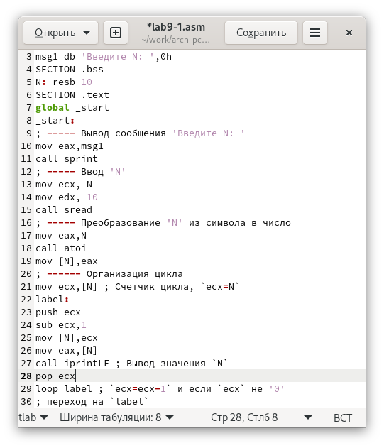{ #fig:006 width=70% }

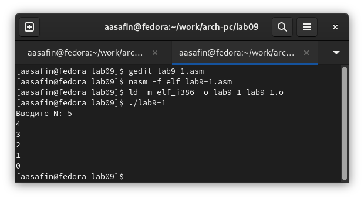{ #fig:007 width=70% }

Создан файл lab9-2.asm, в него введена программа из листинга 9.2, поочередно выводящая введенные аргументы (рис. [-@fig:008]). При выполнении было обработано 4 аргумента (рис. [-@fig:009]).

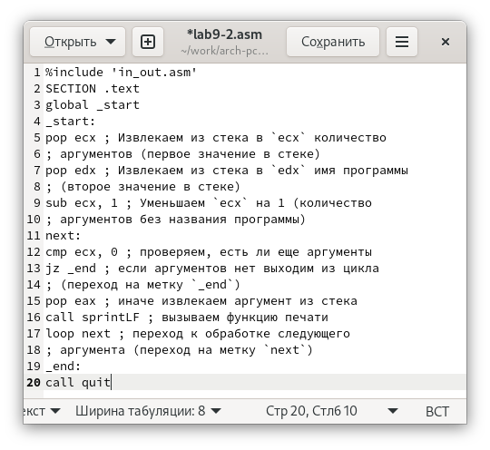{ #fig:008 width=70% }

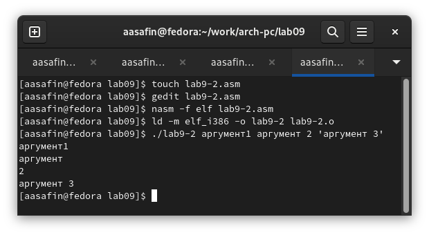{ #fig:009 width=70% }

Создан файл lab9-3.asm, в него введена программа из листинга 9.3, вычисляющая сумму всех аргументов, введенных с командной строки, с помощью цикла и стека (рис. [-@fig:010]). Её работа корректна (рис. [-@fig:011]). Текст изменен так (рис. [-@fig:012]), чтоб вычислялась не сумма, а произведение (рис. [-@fig:013]).

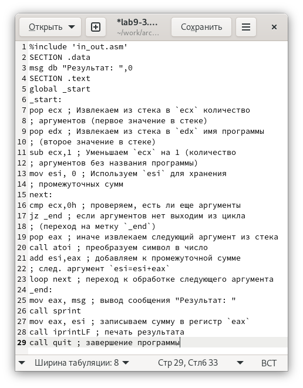{ #fig:010 width=70% }

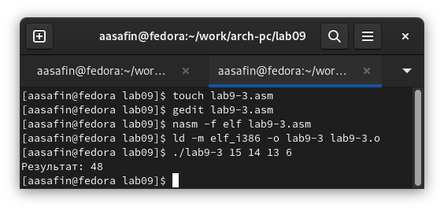{ #fig:011 width=70% }

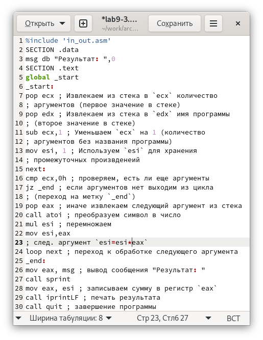{ #fig:012 width=70% }

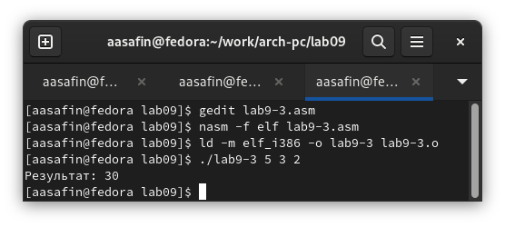{ #fig:013 width=70% }

# Самостоятельная работа

Написана программа, вычисляющая сумму значений функции f(x)=12x-7 для аргументов, введенных с командной строки (рис. [-@fig:014]). Её работа проверена на нескольких примерах (рис. [-@fig:015]). Выполнение корректно. 

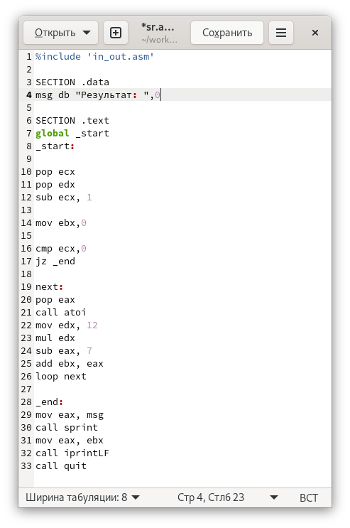{ #fig:014 width=70% }

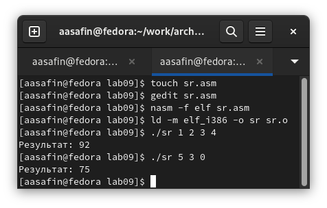{ #fig:015 width=70% }

# Выводы

Все программы написаны и вполнены корректно. В процессе лабораторной работы приобретен навык работы с командой цикла loop и стеком.

