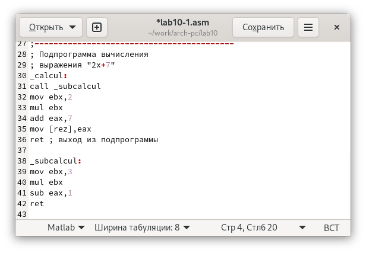

---
## Front matter
title: "Лабораторная работа номер 10"
author: "Сафин Андрей Алексеевич"

## Generic otions
lang: ru-RU
toc-title: "Содержание"

## Pdf output format
toc: true # Table of contents
toc-depth: 2
lof: true # List of figures
lot: true # List of tables
fontsize: 12pt
linestretch: 1.5
papersize: a4
documentclass: scrreprt
## I18n polyglossia
polyglossia-lang:
  name: russian
  options:
	- spelling=modern
	- babelshorthands=true
polyglossia-otherlangs:
  name: english
## I18n babel
babel-lang: russian
babel-otherlangs: english
## Fonts
mainfont: PT Serif
romanfont: PT Serif
sansfont: PT Sans
monofont: PT Mono
mainfontoptions: Ligatures=TeX
romanfontoptions: Ligatures=TeX
sansfontoptions: Ligatures=TeX,Scale=MatchLowercase
monofontoptions: Scale=MatchLowercase,Scale=0.9
## Biblatex
biblatex: true
biblio-style: "gost-numeric"
biblatexoptions:
  - parentracker=true
  - backend=biber
  - hyperref=auto
  - language=auto
  - autolang=other*
  - citestyle=gost-numeric
## Pandoc-crossref LaTeX customization
figureTitle: "Рис."
tableTitle: "Таблица"
listingTitle: "Листинг"
lofTitle: "Список иллюстраций"
lotTitle: "Список таблиц"
lolTitle: "Листинги"
## Misc options
indent: true
header-includes:
  - \usepackage{indentfirst}
  - \usepackage{float} # keep figures where there are in the text
  - \floatplacement{figure}{H} # keep figures where there are in the text
---

# Цель работы

Приобретение навыков написания программ с использованием подпрограмм.
Знакомство с методами отладки при помощи GDB и его основными возможно-
стями.

# Задание

Написать и отладить ряд программ с использованием подпрограмм.

# Ход лабораторной работы

1. Создан файл ~/work/arch-pc/lab10/lab10-1.asm с программой, вычисляющей f(x)=2x+7 с использованием подпрограммы (рис. [-@fig:001]). Ее работа проверена (рис. [-@fig:002]). В текст добавлена подпрограмма (рис. [-@fig:003]), вычисляющая g(x)=3x-1, и ссылка на неё вставлена в lab10-1.asm так, что вычисляется f(g(x)) (рис. [-@fig:004]). 

{ #fig:001 width=70% }

{ #fig:002 width=70% }

{ #fig:003 width=70% }

{ #fig:004 width=70% }

2. Создан файл lab10-2.asm с текстом программы из листинга 10.2 (рис. [-@fig:005]), печатающей Hello world. Файл оттранслирован, скомпанован и загружен в отладчик gdb (рис. [-@fig:006]). Проверена её работа с помощью run (рис. [-@fig:007]). Установлен брейкпоинт на _start (рис. [-@fig:008]). С этой же метки программа дизассемблирована сначала в синтаксисе ATT (рис. [-@fig:009]), а затем в intel (рис. [-@fig:010]). Из наблюдаемых отличий, в ATT ставится $ перед численными операндами и адресам, и % перед регитсрами.

{ #fig:005 width=70% }

{ #fig:006 width=70% }

{ #fig:007 width=70% }

{ #fig:008 width=70% }

{ #fig:009 width=70% }

{ #fig:010 width=70% }

Включен режим псевдографики, просмотрена информация по точкам останова, создана ещё одна. (рис. [-@fig:011]). С помощью stepi выполнено пять инструкций (рис. [-@fig:012]-[-@fig:016]). Изменялись значения регистров eax, ebx, ecx и edx. 

{ #fig:011 width=70% }

{ #fig:012 width=70% }

{ #fig:013 width=70% }

{ #fig:014 width=70% }

{ #fig:015 width=70% }

{ #fig:016 width=70% }

Значениу msg1 просмотрено (рис. [-@fig:017]), изменено (рис. [-@fig:018]), а затем просмотрено и изменено значени msg2 ((рис. [-@fig:019]). Выведены в различных форматах значение edx (рис. [-@fig:020]). C помощью команды set изменено значение ebx сначала на строчную двойку, а затем на численную. Поскольку в обоих случаях выводится численное значение двойки, вывод отличется (рис. [-@fig:021]). После выполнение программы было заверешер с помощью quit.

{ #fig:017 width=70% }

{ #fig:018 width=70% }

{ #fig:019 width=70% }

{ #fig:020 width=70% }

{ #fig:021 width=70% }

3. Скопирован lab9-2.asm в lab10-3.asm, а затем к итоговой программе применен gdb при введении многих аргументов с помощью ключа --args (рис. [-@fig:022]). Установлена точка останова на _start (рис. [-@fig:023]). Выведено число аргументов, хранящееся в esp (рис. [-@fig:024]). Выведены значения в остальных позициях стека (рис. [-@fig:025]). Адресация сдвигается на четыре, так как на элемент стека выведено по 4 байта.

{ #fig:022 width=70% }

{ #fig:023 width=70% }

{ #fig:024 width=70% }

{ #fig:025 width=70% }

# Самостоятельная работа

1. Изменена программа из лабораторной работы 9 так, что f(x) вычисляется в подпрограмме (рис. [-@fig:026], [-@fig:027]). Результат полностью соответствует таковому из лабораторной работы 9.

{ #fig:026 width=70% }

{ #fig:027 width=70% }

2. Создан файл sr2.asm (рис. [-@fig:028]), в который введена программа из листинга 10.3, вычисляющая 4(3+2)+5 с ошибкой (рис. [-@fig:029]). С помощью отладчика рассмотрены изменения в регистрах (рис. [-@fig:030]-[-@fig:033]). По ним видно, что ошибка возникает из-за сохранения результата суммы в ebx и продолжения работы с этим регистром несмотря на то, что умножение выполняется с eax. Ошибка исправлена (рис. [-@fig:034]). Программа выполняется верно (рис. [-@fig:035]).

{ #fig:028 width=70% }

{ #fig:029 width=70% }

{ #fig:030 width=70% }

{ #fig:031 width=70% }

{ #fig:032 width=70% }

{ #fig:033 width=70% }

{ #fig:034 width=70% }

{ #fig:035 width=70% }

# Выводы

Все программы с подпрограммами составлены. Задания по работе с отладчиком выполнены. Навык работы приобретен.

# Список литературы{.unnumbered}

::: {#refs}
:::
