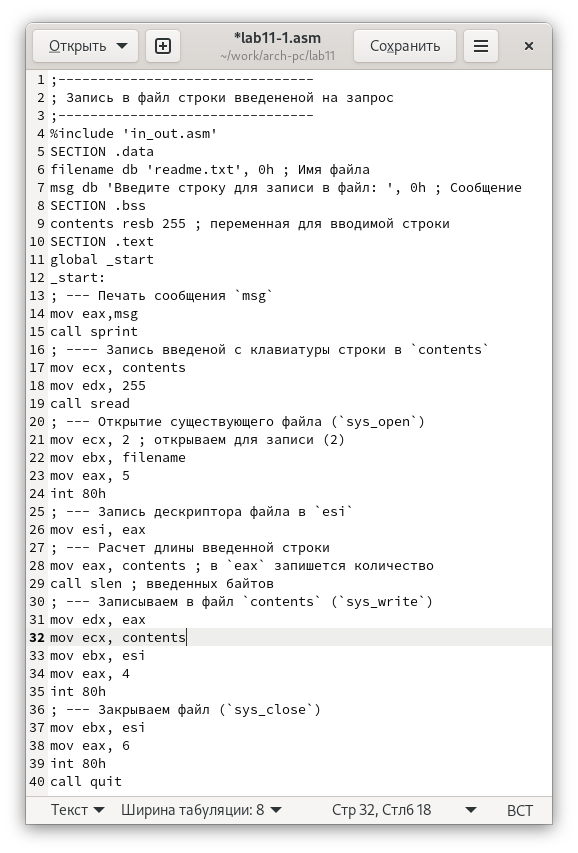
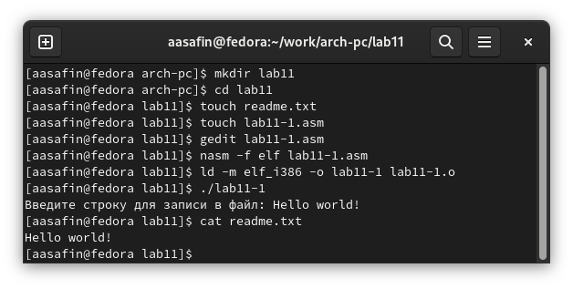
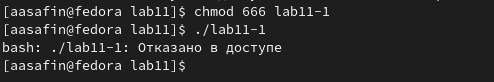
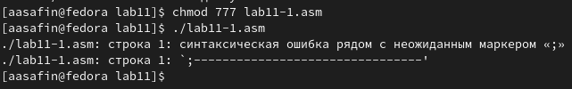
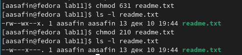
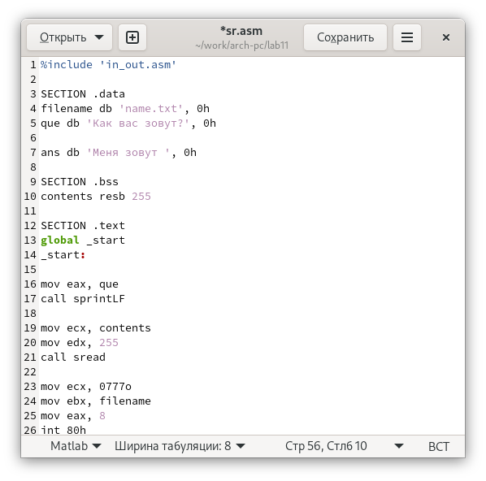
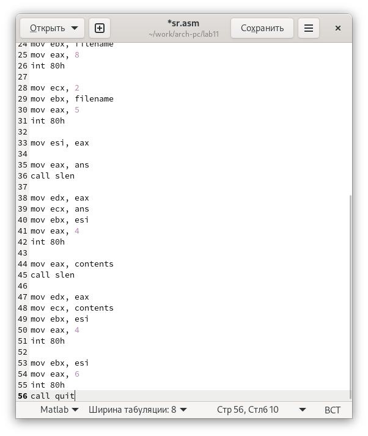
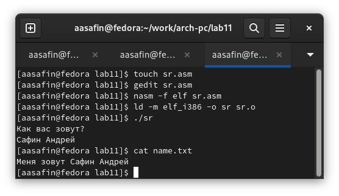

---
## Front matter
title: "Отчёт по лабораторной работе номер 11"
author: "Сафин Андрей Алексеевич"

## Generic otions
lang: ru-RU
toc-title: "Содержание"

## Pdf output format
toc: true # Table of contents
toc-depth: 2
lof: true # List of figures
lot: true # List of tables
fontsize: 12pt
linestretch: 1.5
papersize: a4
documentclass: scrreprt
## I18n polyglossia
polyglossia-lang:
  name: russian
  options:
	- spelling=modern
	- babelshorthands=true
polyglossia-otherlangs:
  name: english
## I18n babel
babel-lang: russian
babel-otherlangs: english
## Fonts
mainfont: PT Serif
romanfont: PT Serif
sansfont: PT Sans
monofont: PT Mono
mainfontoptions: Ligatures=TeX
romanfontoptions: Ligatures=TeX
sansfontoptions: Ligatures=TeX,Scale=MatchLowercase
monofontoptions: Scale=MatchLowercase,Scale=0.9
## Biblatex
biblatex: true
biblio-style: "gost-numeric"
biblatexoptions:
  - parentracker=true
  - backend=biber
  - hyperref=auto
  - language=auto
  - autolang=other*
  - citestyle=gost-numeric
## Pandoc-crossref LaTeX customization
figureTitle: "Рис."
tableTitle: "Таблица"
listingTitle: "Листинг"
lofTitle: "Список иллюстраций"
lotTitle: "Список таблиц"
lolTitle: "Листинги"
## Misc options
indent: true
header-includes:
  - \usepackage{indentfirst}
  - \usepackage{float} # keep figures where there are in the text
  - \floatplacement{figure}{H} # keep figures where there are in the text
---

# Цель работы

Приобретение навыков написания программ для работы с файлами и использования команд предоставления доступа.

# Задание

Создать ряд программ, работающих с файлами. Изменить права доступа к файлам, указанным в лабораторной работе.

# Выполнение лабораторной работы

1. Создана директория ~/work/arch-pc/lab11, в ней - файлы readme.txt и lab11-1.asm (рис. [-@fig:002]).

2. В файл lab11-1.asm введен текст из листинга 11.1 (рис. [-@fig:001]). Работа файла проверена (рис. [-@fig:002]). 

{ #fig:001 width=70% }

{ #fig:002 width=70% }

3. Изменены права доступа к lab11-1: запрещено использование для любых пользователей. В результате невозможно запустить работу программы (рис. [-@fig:003]). 

4. К правам доступа lab11-1.asm добавлено исполнение. Однако оно невозможно, так как файл текстовый, и его содержание не имеет смысла с точки зрения машинного кода (рис. [-@fig:004]).

5. Файлу readme.txt присвоены различные права доступаЮ соответствующие сначала численным, а затем буквенным кодам варината 13. Правильность выполнения проверена с помощью ls -l (рис. [-@fig:005]).

{ #fig:003 width=70% }

{ #fig:004 width=70% }

{ #fig:005 width=70% }

# Самостоятельная работа

Написана программа sr, описанная в лабораторной работе, выводящая вопрос “Как Вас зовут?”, и вводящая ответ вместе с припиской "Вас зовут " в файл (рис. [-@fig:006]-[-@fig:007]). Работа проверена (рис. [-@fig:008]).

{ #fig:006 width=70% }

{ #fig:007 width=70% }

{ #fig:008 width=70% }

# Выводы

Представленные задания по работе с файлами выполнены. Навыки использования команд, изменяющих права доступа, и написания программ, взаимодействующих с файлами, получены.

